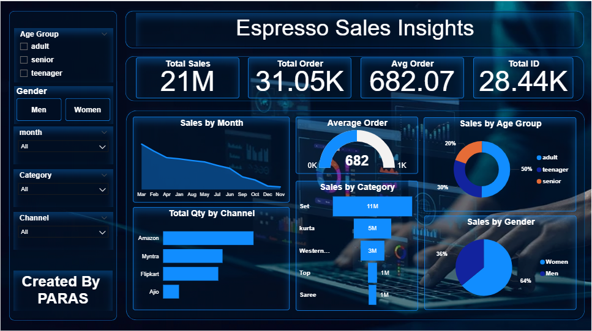

# ☕ Espresso Sales Insights Dashboard

A dynamic and interactive **Power BI dashboard** that analyzes espresso store sales across India. This project explores key performance indicators, sales trends, customer demographics, product categories, and sales channels — all in one sleek, data-rich visualization experience.

---

## 📊 Project Overview

**Objective:**  
To transform raw sales data into meaningful business insights using interactive Power BI visualizations that uncover trends in revenue, customer behavior, and product performance.

**Key Insights Covered:**
- Total Sales, Orders, Average Order Value
- Monthly Sales Trends
- Sales by Gender and Age Group
- Sales by Product Category and Channel
- City and State-level Sales Analysis
- Interactive Filters for Deep Dive

---

## 🧩 Dashboard Features

| Metric              | Description                                  |
|---------------------|----------------------------------------------|
| 💰 **Total Sales**     | Overall revenue generated                   |
| 📦 **Total Orders**    | Number of successful orders                 |
| 🧾 **Average Order**   | Average value per order                     |
| 👤 **Total Customers** | Unique customer IDs                         |
| 📅 **Monthly Trend**   | Sales performance over time                 |
| 🎯 **Category Sales**  | Top-selling product categories              |
| 📍 **Geo Sales**       | Sales by state/city                         |
| 🛒 **Sales Channels**  | Channel-wise (Amazon, Flipkart, etc.) sales |

---

## 📁 Files Included

| File                            | Description                              |
|----------------------------------|------------------------------------------|
| `Espresso Sales Insights.pbix`  | Power BI dashboard file                  |
| `espresso sales.xlsx`           | Cleaned sales dataset                    |
| `Dashboard.PNG`                 | Dashboard screenshot                     |
| `Background.png`                | Custom dashboard background (dark mode)  |

---

## 🎨 Tools & Skills Used

- **Power BI** – Data modeling, DAX, dynamic visuals
- **Microsoft Excel** – Data cleaning, pivot logic
- **Data Analysis** – KPI tracking, demographic insights
- **Design** – UI layout, dark theme dashboard styling

---

## 📌 How to Use

1. Download the repository or clone it using:
2. Open `Espresso Sales Insights.pbix` in **Power BI Desktop**
3. Interact with slicers and charts for insights

---

## 👤 Created By

**Paras Chaturvedi**  
📍 India  
💼 Aspiring Data Analyst | Power BI Enthusiast  
🔗 [Your LinkedIn URL here] (optional)

---

⭐ If you found this project helpful or inspiring, feel free to **star** the repo or **fork** it to your own GitHub!
